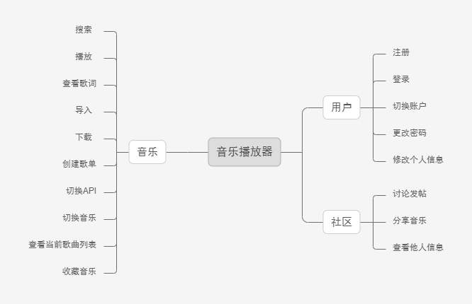

# 软件工程

华科2020级软件工程小组作业

### 小组成员：

张文浩
李会鑫
王煜明
阚广驰
======

# 音乐播放器

## 项目立项

### NABCD model
**Need**：现在网络上各种音乐播放器鱼龙混杂，其中几个较为知名的软件的功能都过于臃肿，增加了许多无关的比如直播等功能；同时由于不同公司拥有的音乐版权不同，绝大部分用户使用着不止一款音乐播放器软件；而且经过调研，大部分的音乐播放器使用用户都希望在软件中加入社区功能，用户可以及时将自己喜欢的歌曲分享给自己的朋友。本项目保证音乐播放器的基本功能，并对上述需求进行针对性的实现。

**Approach**：技术层面：开发一款PC端音乐播放器，用户在登录之后可以进行音乐的搜索、播放、导入、下载，创建歌单等；同时增加社区功能，可以实时分享音乐，也可以发帖讨论；通过调用已有的不同音乐播放器的API，来获取不同音乐播放器拥有的不同歌曲。商业模式：与一些互联网企业合作推广产品，在使用其他软件的API时最好使用开源API或者征得对方公司的同意。在用户基数大的时候追加新的功能，比如切换页面主题，切换播放音效，播放mv视频，听歌识曲，付费一次性买断API使用权等。

**Benefit**：本软件基础功能齐全而不臃肿，舍弃一些于音乐播放器而言无关紧要的功能。本软件可以访问多个音乐播放器软件的音乐资源，让用户仅通过一款软件就可以收听到绝大部分音乐。避免出现一台电脑上下载多个音乐播放器软件，为了找一首歌曲而来回切换软件的情况。根据用户的反馈，可以增加其他音乐播放器软件的API。完善社区功能，用户可以在其中实时交流与分享，体会到实时社交的感觉，让用户在使用软件时有更真实的互动感。

**Competitors**：目前绝大部分音乐播放器软件都不能覆盖到绝大部分的音乐，比如缺乏某些歌手的音乐版权，或者某些音乐需要收费才可以收听或者下载，而我们的软件可以在极大程度上解决了这些问题，在用户之间可能会受到很大的欢迎。

**Delivery**：与一些企业合作，将软件打磨地更加美观和稳定。本项目没有考虑视频播放的功能，可以扩展实现播放视频的功能，因为有很多的用户会选择观看音乐的mv等。同时尝试加入收费机制，普通用户可以使用部分音乐播放器的API，通过收费来获取其他API。也尝试加入切换页面主题，切换播放音效，听歌识曲等较为常见而且实用的功能。

### mindmap

### 基本目标
1. 用户的注册、登录、修改个人信息。
2. 音乐的搜索、播放、切换歌曲、查看当前歌曲列表、导入、下载、查看歌词、创建歌单、收藏音乐、访问其他公开的歌单、切换音乐库API等。
3. 在社区中分享音乐、发帖讨论、查看他人信息等。

### 可行性分析
**技术可行性**：本款软件主要涉及到的技术是界面设计与数据库的使用，主要会使用html、css、JavaScript、vue、electron、webpack、node.js等，本小组成员已经有人学习过相关知识，而且自学能力比较强，即使没有学习过，也可以边学边实践，最终实现项目。

**经济可行性**：该项目主要进行软件的开发，投入的成本和资源较少。如果能解决用户使用音乐播放器的痛点，或许可以带来可观的效益。如果在以后将该项目进行宣传与推广具有比较广阔的市场前景。

**社会可信性**：该项目使用的音乐库API均是开源API，并且已经有类似的软件使用过这些开源的API，所以该形目符合社会道德与法律等规范，并且运行方式在用户组织内是可行的，现有小组管理制度、组员素质、操作方式方面也是可行的。
 
### 人员分工
todo

