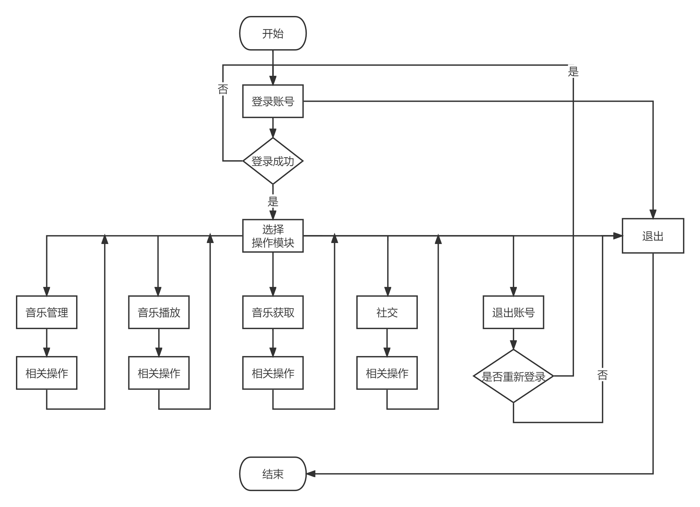
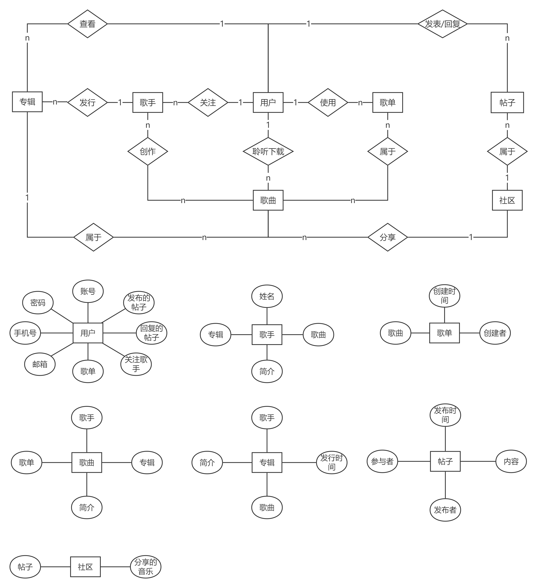

## 需求分析概述
### 简要分析
可以将音乐播放器划分为不同的功能模块，针对不同的功能模块，对不同的模块进行简要的需求分析，并对使用流程进行简要的描述。
1. 用户模块：

（1）登录：使用正确的已注册的网易云音乐账号登录，登录成功后进入用户使用界面，登录失败时重新登录。

（2）退出：退出账号或者退出软件。

2. 音乐播放模块：

（1）播放与暂停：点击歌曲进行播放，同时显示歌曲名、歌手名、专辑名、歌词等信息。按下暂停按钮，播放中的音乐停止，同时歌词停止滚动。

（2）上一曲/下一曲：按下对应按钮实现播放音乐的切换。

（3）前进/后退：拖拽进度条实现歌曲前进后退。

（3）查看歌曲列表：按下相应按钮，显示当前歌曲列表。

（4）收藏音乐：将当前歌曲放入某一创建好的歌单中。

3. 音乐获取模块：

（1）切换音乐库：切换使用的音乐库API，使用不同的音乐库资源。

（2）搜索：在当前音乐库下搜索自己想要的音乐或者歌手。

（3）下载音乐：下载想要的音乐。

（4）访问歌单：访问其他用户公开的歌单。

4. 音乐管理模块：

（1）创建歌单：创建一个空歌单，用来保存一类音乐。

（2）操作歌单：操作已经创建的歌单，对其中的歌曲进行删除或者删除歌单等操作。

（3）导入音乐：将本地音乐导入到播放器中。

5. 社交模块：

（1）讨论发帖：在社区中发起讨论，与不同的用户交流自己的意见。

（2）分享音乐：将自己喜欢的音乐分享给其他用户或这社区中。

6. 播放器界面：力求简洁与直观，取消一些无关紧要的内容，将最重要的功能在最明显的地方展示出来。

7. 使用流程：根据对需求的简要分析，我们可以简要描述用户在使用软件时的流程：首先登录账号，成功之后选择一个功能模块：音乐管理、音乐播放、音乐获取、社交。进入音乐管理模块，用户可以创建和查看自己的歌单，或者导入本地音乐，最后退出该模块。进入音乐播放模块内部，用户可以控制音乐的播放和暂停，切换音乐，查看相关信息、歌词，查看歌曲列表，收藏音乐等，最后退出该模块。进入音乐获取模块，用户可以选择切换音乐库，搜索音乐，下载音乐，查看他人歌单等，最后退出该模块。进入社交模块，用户可以发帖子，分享音乐等，最后退出该模块。当用户结束自己的使用时，退出账号或者退出软件。

使用流程图：

### 结构化方法
1. E-R图

2. 数据流图

（1）顶级数据流图
![img-topdatastreammap](./顶级数据流图.png）

